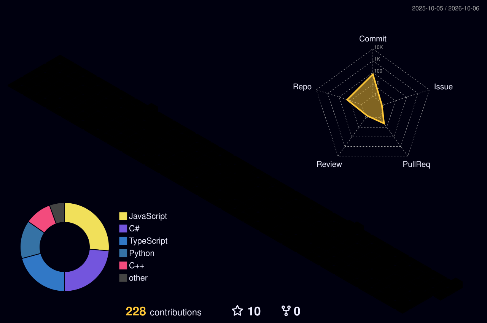

<div align="center">



<a href="https://github.com/ZeonArc">
  
</a>

<br><br>

<a href="https://linkedin.com/in/harishvdev"></a>
<a href="https://harishvportfolio.vercel.app/"></a>
<a href="mailto:harishvofficialwork@gmail.com"></a>

<br>


</div>

---

## 👋 About Me

I'm a game developer who enjoys the space where **gameplay systems**, **AI** and **real-time performance** meet. I build scalable, well-architected systems in Unity and ship full-stack products on the side.

```cpp
class HarishV {
public:
    string role           = "Game Developer";
    string specialization = "Gameplay Systems & AI";

    vector<string> technologies = {
        "Unity", "C#", "Unreal Engine",
        "Next.js", "AI Integration", "Procedural Generation"
    };

    void currentFocus() {
        cout << "Building scalable gameplay systems and immersive experiences.";
    }
};
```

| | |
|---|---|
| 🎮 **Gameplay Programming** | 🤖 **AI-Driven Interactions** |
| 🌍 **Procedural World Generation** | ⚡ **Real-Time Systems** |
| 🧠 **Full-Stack SaaS Applications** | 🎓 **Unity Certified Associate** |

---

## 🎯 Focus Tracker

A live tracker of what I'm working on. It's rendered from [`data/tracker.json`](data/tracker.json) by a [GitHub Action](.github/workflows/profile-tracker.yml).

<!--FOCUS:START-->
| Focus area | Status | Progress |
|---|---|---|
| Gameplay systems architecture | In progress | `██████░░░░` 60% |
| Advanced Unity (DOTS / URP) | In progress | `████░░░░░░` 40% |
| AI-driven interactive experiences | In progress | `█████░░░░░` 50% |
| Large-scale game project contributions | Planned | `██░░░░░░░░` 20% |
<!--FOCUS:END-->

<details open>
<summary><b>⚡ Latest GitHub activity</b></summary>
<br>

<!--ACTIVITY:START-->
- 🔀 Opened pull request in [Dr2gOnv1mp1re/SIH-2026](https://github.com/Dr2gOnv1mp1re/SIH-2026) — <sub>4h ago</sub>
- ✨ Created branch in [Dr2gOnv1mp1re/SIH-2026](https://github.com/Dr2gOnv1mp1re/SIH-2026) — <sub>4h ago</sub>
- ✨ Created branch in [ZeonArc/WebPort](https://github.com/ZeonArc/WebPort) — <sub>2d ago</sub>
- ⬆️ Pushed 1 commit to [ZeonArc/ZeonArc](https://github.com/ZeonArc/ZeonArc) — <sub>2d ago</sub>
- ⬆️ Pushed 1 commit to [ZeonArc/ZeonArc](https://github.com/ZeonArc/ZeonArc) — <sub>2d ago</sub>
<!--ACTIVITY:END-->

</details>

<details open>
<summary><b>📦 Recently active repositories</b></summary>
<br>

<!--REPOS:START-->
| Repository | Language | ⭐ | Last push |
|---|---|---|---|
| [WebPort](https://github.com/ZeonArc/WebPort) | TypeScript | 0 | 2d ago |
| [ArcEngineC-](https://github.com/ZeonArc/ArcEngineC-) | C# | 1 | 10d ago |
| [IEEEMetaverse2026](https://github.com/ZeonArc/IEEEMetaverse2026) | C# | 1 | 37d ago |
| [DevLeap-AI](https://github.com/ZeonArc/DevLeap-AI) | TypeScript | 1 | 45d ago |
| [finalportfolio](https://github.com/ZeonArc/finalportfolio) | JavaScript | 1 | 51d ago |
<!--REPOS:END-->

</details>

<!--UPDATED:START-->
<sub>Last updated: 2026-10-03 16:15 UTC</sub>
<!--UPDATED:END-->

---

## ⚙️ Tech Stack

<div align="center">

| Domain | Technologies |
|:---:|:---|
| **🎮 Game Development** |  |
| **🌐 Full-Stack** |  |
| **☁️ Tools & Platforms** |  |

</div>

---

## 🚀 Featured Projects

<div align="center">

| Project | Description | Tech |
|---|---|---|
| 🎯 **Equilibrium** | Strategy-based Unity game with adaptive AI systems and immersive rendering pipelines | Unity, C#, NavMesh |
| 🌍 **PixelMine** | Minecraft-inspired procedural sandbox world with chunk generation | Java, OOP |
| 🤖 **DocuGitHub** | AI-powered SaaS platform for software documentation generation | Next.js, OpenAI, GCP |

</div>

<details>
<summary><b>🎯 Equilibrium — details</b></summary>

```yaml
Engine: Unity 6
Language: C#
Architecture: Singleton-Based
Features:
  - Dynamic NPC AI
  - NavMesh Navigation
  - Audio Mixer Systems
  - URP Post Processing
```

</details>

<details>
<summary><b>🌍 PixelMine — details</b></summary>

```yaml
Inspired By: Minecraft
Core Systems:
  - Procedural Biome Generation
  - Chunk Rendering
  - Camera Systems
  - Object-Oriented World Logic
```

</details>

<details>
<summary><b>🤖 DocuGitHub — details</b></summary>

```yaml
Stack:
  - Next.js
  - OpenAI API
  - GCP
Features:
  - AI Documentation
  - Mermaid.js Architecture Diagrams
  - Zero-Retention Processing
```

</details>

More on my [GitHub profile](https://github.com/ZeonArc) and [portfolio](https://harishvportfolio.vercel.app/).

---

## 📊 GitHub Analytics

<div align="center">

<table>
<tr>
<td width="50%"></td>
<td width="50%"></td>
</tr>
<tr>
<td width="50%"></td>
<td width="50%"></td>
</tr>
</table>


<br><br>



</div>

<sub>Cards are generated by GitHub Actions and stored in this repo, so they don't depend on third-party servers.</sub>

---

## 🏆 Achievements

<div align="center">



</div>


---

## 🎯 Current Goals

```diff
+ Build immersive gameplay systems
+ Master advanced Unity architecture
+ Contribute to large-scale game projects
+ Explore AI-driven interactive experiences
```

---

## 🐍 Contribution Snake

<div align="center">

<picture>
  <source media="(prefers-color-scheme: dark)" srcset="https://raw.githubusercontent.com/ZeonArc/ZeonArc/output/github-contribution-grid-snake-dark.svg" />
  <source media="(prefers-color-scheme: light)" srcset="https://raw.githubusercontent.com/ZeonArc/ZeonArc/output/github-contribution-grid-snake.svg" />
  
</picture>

</div>

---

## 📫 Connect With Me

<div align="center">

<a href="https://linkedin.com/in/harishvdev"></a>
<a href="https://harishvportfolio.vercel.app/"></a>
<a href="mailto:harishvofficialwork@gmail.com"></a>

<br><br>


<br>

<sub><b>Building immersive systems, one project at a time.</b></sub>

</div>
